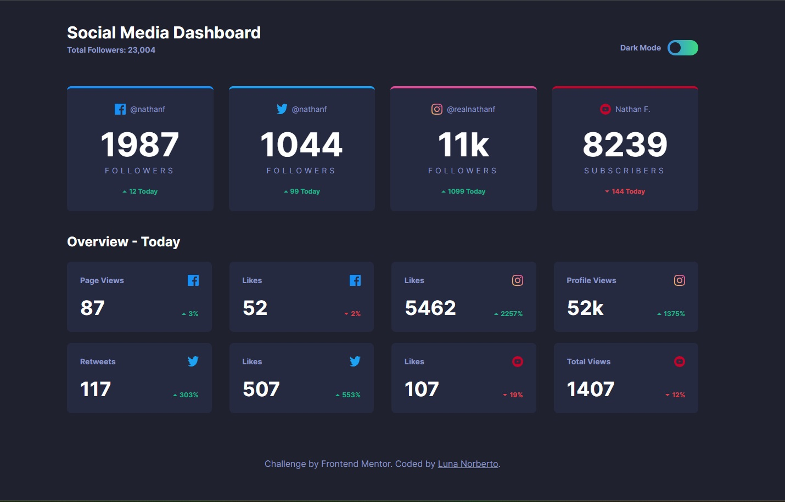

# Frontend Mentor - Social media dashboard with theme switcher solution

This is a solution to the [Social media dashboard with theme switcher challenge on Frontend Mentor](https://www.frontendmentor.io/challenges/social-media-dashboard-with-theme-switcher-6oY8ozp_H).

## Table of contents

- [Overview](#overview)
  - [The challenge](#the-challenge)
  - [Screenshot](#screenshot)
  - [Links](#links)
- [My process](#my-process)
  - [Built with](#built-with)
  - [What I learned](#what-i-learned)
  - [Useful resources](#useful-resources)
- [Author](#author)
- [Acknowledgments](#acknowledgments)

## Overview

### The challenge

Users should be able to:

- View the optimal layout for the site depending on their device's screen size
- See hover states for all interactive elements on the page
- Toggle color theme to their preference

### Screenshot



### Links

- Solution URL: [Solution](https://github.com/Grathienbeto/social-media-dashboard)
- Live Site URL: [Live site](https://your-live-site-url.com)

## My process

### Built with

- Semantic HTML5 markup
- CSS custom properties
- Flexbox
- CSS Grid
- Mobile-first workflow
- [React](https://reactjs.org/) - JS library
- [Tailwind](https://tailwindcss.com/) - For styles

### What I learned

How to add Light/Dark mode to a page using states and Tailwind

```js
  // add this to the tailwind.config.js
  darkMode: "class",
```

```js
// in a component, create a state for darkmode. First, it checks if the user has darkmode enabled in it system
const [theme, setTheme] = useState(() => {
  if (window.matchMedia("(prefers-color-scheme: dark)").matches) {
    return "dark";
  }
  return "";
});

// using a useEffect for re-rendering the page when changing modes
useEffect(() => {
  if (theme === "dark") {
    document.querySelector("html").classList.add("dark");
  } else {
    document.querySelector("html").classList.remove("dark");
  }
}, [theme]);

// event handler to add to the change theme button
const handleChangeTheme = () => {
  setTheme((prevTheme) => (prevTheme === "" ? "dark" : ""));
};
```

### Useful resources

- [Dark mode tutorial Tailwind + React](https://www.youtube.com/watch?v=_8FTL-xNz9Q&ab_channel=FaztCode). Video in spanish.

## Author

- Github - [Grathienbeto](https://github.com/Grathienbeto)
- Frontend Mentor - [@Grathienbeto](https://www.frontendmentor.io/profile/Grathienbeto)
- Twitter - [@betoluna89](https://www.twitter.com/betoluna89)

## Acknowledgments

Been watching the videos of [Fazt](https://www.youtube.com/@FaztTech) for a long time. Great content for any spanish dev students out there!
